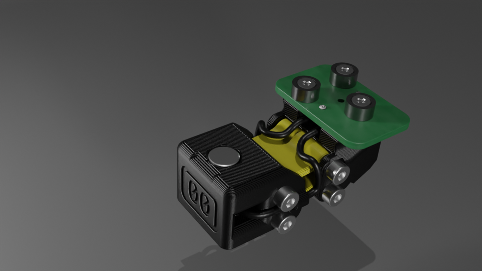

# Klicky-00: Zero X,Y offset probe (WIP)

Building on the amazing work of JosAr ([Klicky Probe](https://github.com/jlas1/Klicky-Probe)), whoppingpochard ([PCB Klicky](https://github.com/tanaes/whopping_Voron_mods/tree/main/pcb_klicky)), and Majarspeed ([Unklicky](https://github.com/majarspeed/Unklicky)) this mod moves the probe directly under the nozzle (X,Y 0,0) and also has the nozzle touching the probe so that you can reliably use it as your z endstop with consistent z-offset. All the usual caveats about clean nozzles during probing apply here too.

The goal of this probe is to give TAP-like consistency with repeatable Z-offset even when changing nozzles.

   

   

   

> [!WARNING]  
> Development is completed first for Xol-Toolhead on Xol-Carriage at this stage  
> `untested StealthBurner and Archetype versions are now up`

#### Constraints:
* Low cost
* Easy access to required parts
* Simple add-on to existing ecosystem

### Warning: This is work in progress
It has been tested on Xol-Toolhead and is giving good results. All early development will be based on PCB Klicky for consistent mounting pattern. An untested version that connects with standard Klicky magnets has been uploaded. If you test it, please provide feedback.

### Use 6mm x 3mm magnets
I have designed this around 6x3mm magnets and it will probably fail with the 6x2.7mm magnets that are also common. A mix of N52 and N35 magnets are most likely needed to help "tune" attraction and spring forces.

### Build Guide
Go to the [instructions](instructions.md)

### But why another probe?
Like many others, I installed Voron TAP and loved the consistency, repeatability and user experience, but I didn't like the extra complexity, weight and instability added to the toolhead.
I had previously used KlickyNG with auto-z calibration scripts and while that was good, I ALWAYS had to watch the first layer and make micro-adjustments to Z offset.

This probe takes the reliable docking hardware and software of the PCB Klicky and the high accuracy of the Unklicky BFP and puts them in contact with the probe for repatable z-offset and zero XY offset.

Initial testing in a Voron 2.4R2(300mm) with Xol-Toolhead looks promising.
probe_accuracy standard deviation results vary from 0.0005 to 0.0025 on my printer and that is similar to what I got with TAP.

Drift was also very low with bed temp at 118°C, nozzle 200°C and chamber ~57°C

### References:
* [Klicky Klipper macros](https://github.com/jlas1/Klicky-Probe/tree/main/Klipper_macros)
* [Unklicky build guide](https://github.com/majarspeed/Unklicky/blob/main/Build%20Guide.md)
* [Voron Docs Klicky as Z-endstop](https://docs.vorondesign.com/community/howto/Takuya/Klicky_Probe_AutoZ_Alternative.html)

<a property="dct:title" rel="cc:attributionURL" href="https://github.com/DW-Tas/Klicky-00">Klicky-00</a> by <a rel="cc:attributionURL dct:creator" property="cc:attributionName" href="https://github.com/DW-Tas/">DW Tas</a> is licensed under <a href="http://creativecommons.org/licenses/by-nc-sa/4.0/?ref=chooser-v1" target="_blank" rel="license noopener noreferrer" style="display:inline-block;">CC BY-NC-SA 4.0</a>
