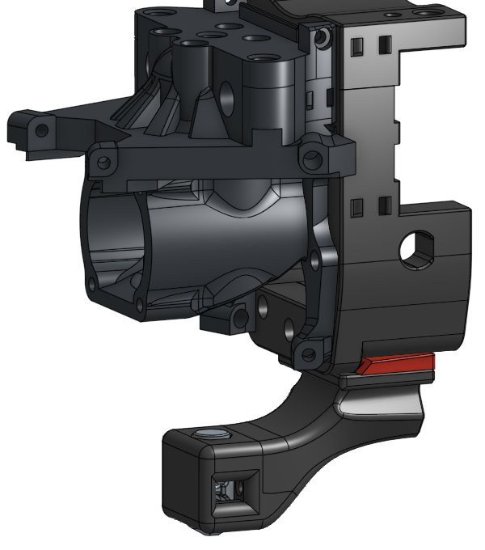

# Klicky-00: Zero X,Y offset probe (WIP)

Building on the amazing work of JosAr ([KlickyNG](https://github.com/jlas1/Klicky-Probe)) and Majarspeed ([Unklicky](https://github.com/majarspeed/Unklicky)) this mod moves the probe directly under the nozzle (X,Y 0,0) and also has the nozzle touching the probe so that you can reliably use it as your z endstop with consistent z-offset. All the usual caveats about clean nozzles during probing apply here too.

The goal of this probe is to give TAP-like consistency with repeatable Z-offset even when changing nozzles.
#### Constraints:
* Low cost
* Easy access to required parts
* Simple add-on to existing ecosystem

### Warning: This is early work in progress
It has been tested on Xol 2 and is giving good results. The Stealthburner version is built from CAD and is yet to be tested.
The early testing has been done on the NG version (KlikcyNG-00) and a standard Klicky version (Klicky-00) has been uploaded, but isn't tested yet.

### Use 6mm x 3mm magnets
I have designed this around 6x3mm magnets and it will probably fail with the 6x2.7mm magnets that are also common. Preferably N52 for at least the probe "spring" magnets.

### But why another probe?
Like many others, I installed Voron TAP and loved the consistency, repeatability and user experience, but I didn't like the extra complexity, weight and instability added to the toolhead.
I had previously used KlickyNG with auto-z calibration scripts and while that was good, I ALWAYS had to watch the first layer and make micro-adjustments to Z offset.

This probe takes the reliable docking hardware and software of the KlickyNG and the high accuracy of the Unklicky BFP and puts them in contact with the probe for repatable z-offset and zero XY offset.

 

Initial testing in a Voron 2.4R2(300mm) with Xol 2 toolhead looks promising.
probe_accuracy standard deviation results vary from 0.0005 to 0.0025 on my printer and that is similar to what I got with TAP.

Drift was also very low with bed temp at 118°C, nozzle 200°C and chamber ~57°C

### References:
* [Klicky Klipper macros](https://github.com/jlas1/Klicky-Probe/tree/main/Klipper_macros)
* [Unklicky build guide](https://github.com/majarspeed/Unklicky/blob/main/Build%20Guide.md)
* [Voron Docs Klicky as Z-endstop](https://docs.vorondesign.com/community/howto/Takuya/Klicky_Probe_AutoZ_Alternative.html)

