# Build Instructions

> [!WARNING]
> You need to have a good understanding of Klicky (+macro settings), probes, offsets and Klipper.

It is highly recommended to have a working PCB Klicky or standard Klicky already installed on your toolhead and configured. Follow the instructions from Josar on the Klicky-Probe Github:
[klipper configuration](https://github.com/jlas1/Klicky-Probe/tree/main/Printers/Voron/v1.8_v2.4_Legacy_Trident#step-5-klipper-configuration) `<br/>`
Make sure to include the steps for [Klicky Probe as Endstop with constant Z-Offset](https://github.com/T4KUUY4/Voron-Stuff/tree/main/KlickyProbeZoffset).

> [!IMPORTANT]
> Klicky-00 is a Loooong probe. It doesn't fit behind the print bed of a standard Voron 2.4 or Trident build without a dock that retracts the probe. See "Bump dock" instructions below.
> `Should be OK with StealthBurner version as the probe is ~5.5mm shorter`

> [!WARNING]
> You need at least 5mm travel on Y past the back of your build plate for this to work.

## Klicky-00 Probe

The probe is built from components of other projects. The original concept of this project is putting the probe under the nozzle in a repeatable/automatable way.

## BOM

The first two tables are specific to the mount type you use. The third table has extra BOM depending on switch type.

### PCB Klicky Version (needed for all switch types)

`[Assumes you already have the PCB Klicky upper mount on your toolhead]`


| Qty | Item                   | Note                                                                                                    |
| ----- | ------------------------ | --------------------------------------------------------------------------------------------------------- |
| 1   | PCB Klicky Lower kit   | Lower PCB with switch removed, magnets, screws and heatset inserts that came with the kit or equivalent |
| 5   | 6x3mm Disc Magnets     | Probably a mix of N52 and N35 strength for adjustability                                                |
| 4   | M3 x 20mm BHCS or SCHS | Swing arm hinges                                                                                        |
| 2   | Lengths of wire        | Less than 2mm sheathing diameter, approx 100mm                                                          |

### Standard Klicky Version (needed for all switch types)

`[Assumes you already have the Klicky mount on your toolhead]`


| Qty | Item                   | Note                                                     |
| ----- | ------------------------ | ---------------------------------------------------------- |
| 8   | 6x3mm Disc Magnets     | Probably a mix of N52 and N35 strength for adjustability |
| 4   | M3 x 20mm BHCS or SCHS | Swing arm hinges                                         |
| 2   | Lengths of wire        | Less than 2mm sheathing diameter, approx 100mm           |

### Extra parts by switch type


| Switch Type    | Qty | Item                                      | Note                                     |
| :--------------- | ----- | ------------------------------------------- | ------------------------------------------ |
| Unklicky       | 1   | M3 x 12mm SHCS                            | Unklicky probe stylus retention screw    |
| D2F            | 1   | D2F switch                                | No lever                                 |
| D2F            | 2   | M2 x 10mm self tapping countersunk screws |                                          |
| Buckshot`Beta` | 3   | M3 x 6 Wafer head screw                   | 6mm head diameter                        |
| Buckshot`Beta` | 1   | 5.5m Ball Bearing                         | not a roller bearing                     |
| Buckshot`Beta` | 1   | 4mm OD x ~10mm long  Spring               | Cut down to length from cheap clicky pen |

## Printed Parts

The tables below provide links for all the parts you will need. Pick one probe attachment type, then front parts and swing arms from the toolhead specific tables below

### Probe Attachment (pick one)


| Attachment Type | STL Links                                                                                                                               |
| ----------------- | ----------------------------------------------------------------------------------------------------------------------------------------- |
| Klicky PCB      | [Klicky-00_PCB_Klicky_Rear.stl](STL/Klicky-00_PCB_Klicky_Rear.stl)                                                                      |
| Klicky Standard | [Klicky-00_Klicky_Rear.stl](STL/Klicky-00_Klicky_Rear.stl) `` *[StealthBuner Probe Mount (Centered)](STL/Klicky-00_Klicky_Mount_SB.stl) |

Pick the parts for your toolhead from one of the tables below

### Xol Toolhead probe parts

#### Switches


| Part                 | STL Links                                                                               |
| ---------------------- | ----------------------------------------------------------------------------------------- |
| Unklicky Front       | [Klicky-00_Xol_Unklicky_Front.stl](STL/Klicky-00_Xol_Unklicky_Front.stl)                |
| D2F Front            | [Klicky-00_Xol_D2F_Front.stl](STL/Klicky-00_Xol_D2F_Front.stl)                          |
| Buckshot Front`Beta` | [Klicky-00_Xol_Buckshot_Front.stl](STL/buckshot[beta]/Klicky-00_Xol_Buckshot_Front.stl) |

#### Swingarms


| Switch Type                             | One-peice Xol Carriage (2024-06 release)                                                                                                                                                                | Two-piece Xol Carriage                                                                                                                                                                                                                                                              |
| ----------------------------------------- | --------------------------------------------------------------------------------------------------------------------------------------------------------------------------------------------------------- | ------------------------------------------------------------------------------------------------------------------------------------------------------------------------------------------------------------------------------------------------------------------------------------- |
| PCB Klicky Swingarms                    | [Xol_PCB_Swingarm_Upper](STL/Klicky-00_Xol_PCB_Swingarm_Upper.stl) [Xol_PCB_Swingarm_Lower](STL/Klicky-00_Xol_PCB_Swingarm_Lower.stl)                                                                   | [Xol_PCB_Swingarm_Upper[two-part_carriage]](STL/Klicky-00_Xol_PCB_Swingarm_Upper[two-part_carriage].stl) [Xol_PCB_Swingarm_Lower[two-part_carriage]](STL/Klicky-00_Xol_PCB_Swingarm_Lower[two-part_carriage].stl)                                                                   |
| Standard Klicky Swingarms               | [Xol_Swingarm_Upper](STL/Klicky-00_Xol_Swingarm_Upper.stl) [Xol_Swingarm_Lower](STL/Klicky-00_Xol_Swingarm_Lower.stl)                                                                                   | [Xol_Swingarm_Upper[two-part_carriage]](STL/Klicky-00_Xol_Swingarm_Upper[two-part_carriage].stl) [Xol_Swingarm_Lower[two-part_carriage]](STL/Klicky-00_Xol_Swingarm_Lower[two-part_carriage].stl)                                                                                   |
| Buckshot PCB Klicky Swingarms Beta      | [Xol_PCB_Swingarm_Upper_Buckshot](STL/buckshot[beta]/Klicky-00_Xol_PCB_Swingarm_Upper_Buckshot.stl) [Xol_PCB_Swingarm_Lower_Buckshot](STL/buckshot[beta]/Klicky-00_Xol_PCB_Swingarm_Lower_Buckshot.stl) | [Xol_PCB_Swingarm_Upper_Buckshot[two-part_carriage]](STL/buckshot[beta]/Klicky-00_Xol_PCB_Swingarm_Upper_Buckshot[two-part_carriage].stl) [Xol_PCB_Swingarm_Lower_Buckshot[two-part_carriage]](STL/buckshot[beta]/Klicky-00_Xol_PCB_Swingarm_Lower_Buckshot[two-part_carriage].stl) |
| Buckshot Standard Klicky Swingarms Beta | [Xol_Swingarm_Upper_Buckshot](STL/buckshot[beta]/Klicky-00_Xol_Swingarm_Upper_Buckshot.stl) [Xol_Swingarm_Lower_Buckshot](STL/buckshot[beta]/Klicky-00_Xol_Swingarm_Lower_Buckshot.stl)                 | [Xol_Swingarm_Upper_Buckshot[two-part_carriage]](STL/buckshot[beta]/Klicky-00_Xol_Swingarm_Upper_Buckshot[two-part_carriage].stl) [Xol_Swingarm_Lower_Buckshot[two-part_carriage]](STL/buckshot[beta]/Klicky-00_Xol_Swingarm_Lower_Buckshot[two-part_carriage].stl)                 |

### Archetype Toolhead probe parts


| Part                     | STL Links                                                                                                                                                                                                          |
| -------------------------- | -------------------------------------------------------------------------------------------------------------------------------------------------------------------------------------------------------------------- |
| Unklicky Front           | [Klicky-00_Archetype_Unklicky_Front.stl](STL/Klicky-00_Archetype_Unklicky_Front.stl)                                                                                                                               |
| D2F Front                | [Klicky-00_Archetype_D2F_Front.stl](STL/Klicky-00_Archetype_D2F_Front.stl)                                                                                                                                         |
| Swingarms                | [Archetype_Swingarm_Upper](STL/Klicky-00_Archetype_Swingarm_Upper.stl) `` [Archetype_Swingarm_Lower](STL/Klicky-00_Archetype_Swingarm_Lower.stl)                                                                   |
| Buckshot Front`Beta`     | [Klicky-00_Archetype_Buckshot_Front.stl](STL/buckshot[beta]/Klicky-00_Archetype_Buckshot_Front.stl)                                                                                                                |
| Buckshot Swingarms`Beta` | [Archetype_Swingarm_Upper_Buckshot](STL/buckshot[beta]/Klicky-00_Archetype_Swingarm_Upper_Buckshot.stl) `` [Archetype_Swingarm_Lower_Buckshot](STL/buckshot[beta]/Klicky-00_Archetype_Swingarm_Lower_Buckshot.stl) |

### StealthBurner Toolhead probe parts


| Part                                        | STL Links                                                                                                            |
| --------------------------------------------- | ---------------------------------------------------------------------------------------------------------------------- |
| Unklicky Front                              | [Klicky-00_SB_Unklicky_Front.stl](STL/Klicky-00_SB_Unklicky_Front.stl)                                               |
| D2F Front                                   | [Klicky-00_SB_D2F_Front.stl](STL/Klicky-00_SB_D2F_Front.stl)                                                         |
| Swingarms (work with Buckshot Beta as well) | [SB_Swingarm_Upper](STL/Klicky-00_SB_Swingarm_Upper.stl) `` [SB_Swingarm_Lower](STL/Klicky-00_SB_Swingarm_Lower.stl) |
| Buckshot Front`Beta`                        | [Klicky-00_SB_Buckshot_Front.stl](STL/buckshot[beta]/Klicky-00_SB_Buckshot_Front.stl)                                |

## Instructions (PCB_Klicky Version with Unklcy switch)


| Note                                                                                                                                                                                                                                                                                                                      | Picture                                           |
| --------------------------------------------------------------------------------------------------------------------------------------------------------------------------------------------------------------------------------------------------------------------------------------------------------------------------- | --------------------------------------------------- |
| Remove the built in support                                                                                                                                                                                                                                                                                               | 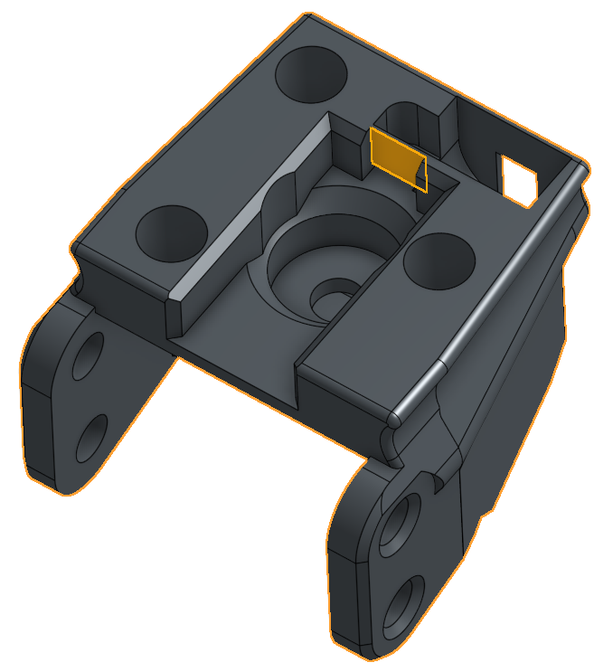      |
| Install the M2 heatset inserts                                                                                                                                                                                                                                                                                            | 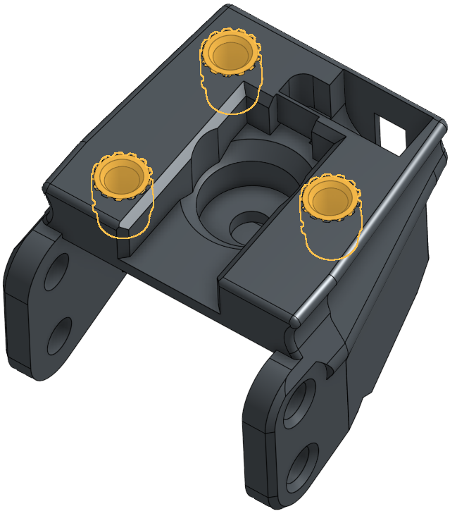    |
| If an M3 screw placed through the swing arms doesn't move freely with low friction, drill out the swing arm holes with M3 drill bit.```Don't over do it! If the screws have too much room the probe will end up wobbly and not be as accurate.`                                                                           | 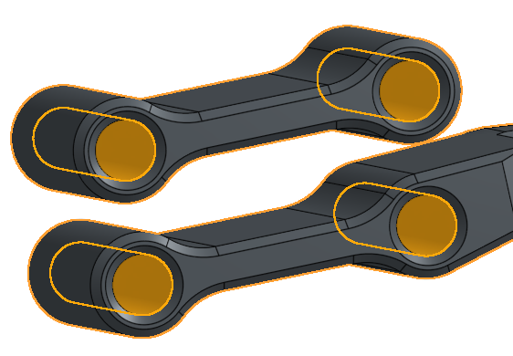          |
| Prepare the probe stylus. Sand it down so it moves smoothly inside the probe front body`Unklicky Version`                                                                                                                                                                                                                 | 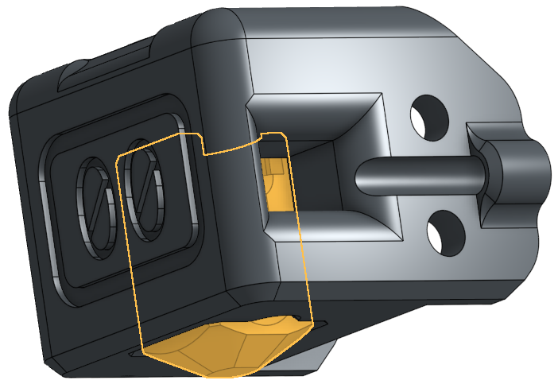      |
| Install the stylus as per UnKlickyBFP. Wire wraps around top of stylus, Magnets are opposing```*TIP: Make sure that the top magnet repells the furthest back magnet on the toolhead. This will make sure that Klicky-00 is pushed down as the toolhead moves over it to attach the probe.`                                | 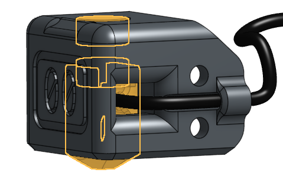      |
| Put the screw in most of the way. Leave room for the second wire to wrap around                                                                                                                                                                                                                                           | 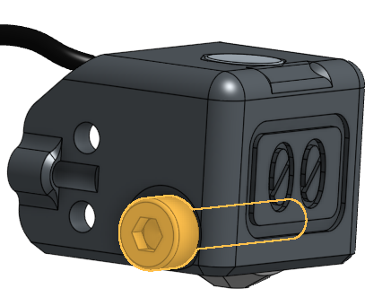     |
| Put the left side wire in place, wrapped around the screw and tighten the screw                                                                                                                                                                                                                                           | 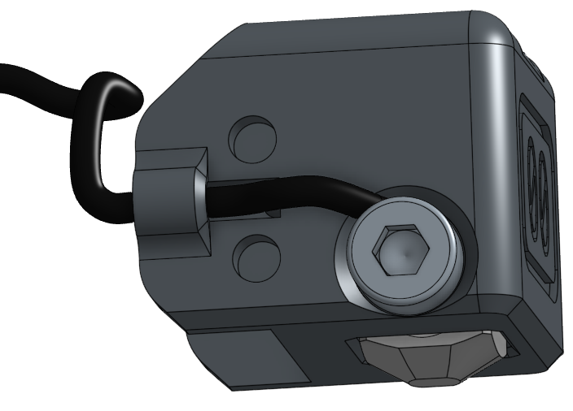           |
| Install the front two swing arm screw hinges                                                                                                                                                                                                                                                                              | 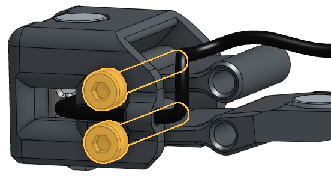        |
| Install a magnet in the back of the lower swing arm                                                                                                                                                                                                                                                                       | 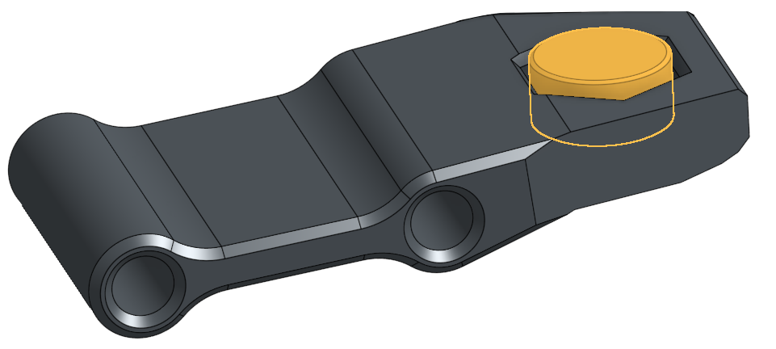    |
| Install the other two swing arm screws                                                                                                                                                                                                                                                                                    | 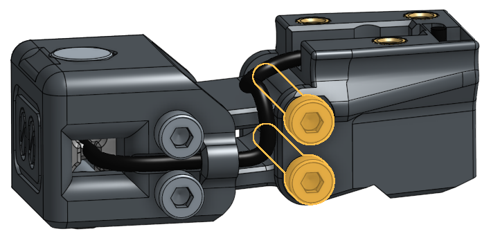        |
| Solder the probe wires to the bottom of the PCB Klicky lower PCB. One in the front, one at the back. Middle hole stays empty                                                                                                                                                                                              | 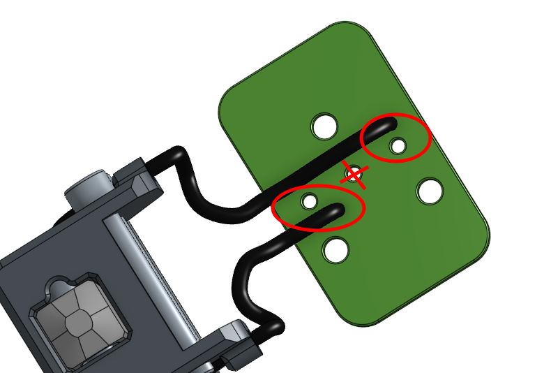        |
| Install the magnets that live under the PCB. The rear one should attract to the dock, the other should repel the lower swing arm. You may need to swap between N35 and N52 magnets to get just enough spring force to activate the swing arm. Too much won't let the arm move and will push the klicky PCB magnets apart. | 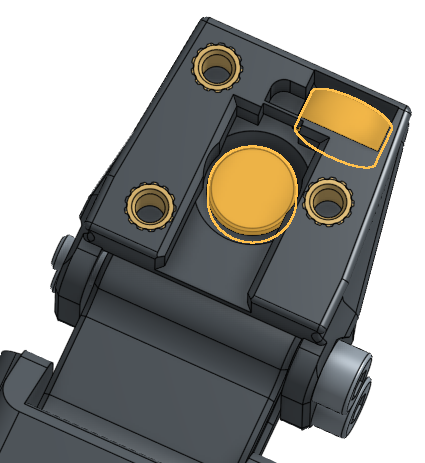   |
| Install the Klicky PCB magnets with the counter sunk screws. Get your polarity right.                                                                                                                                                                                                                                     | 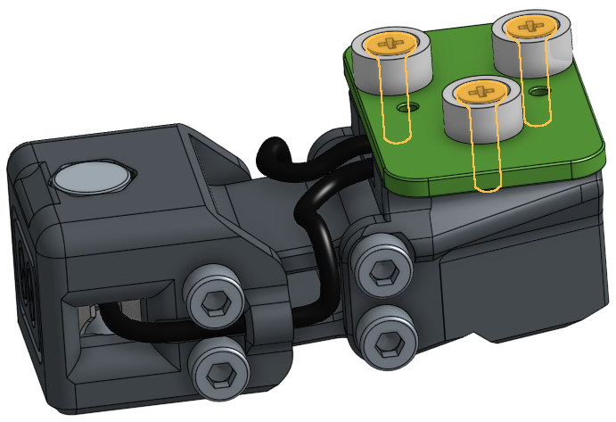 |

## Instructions (Stanrad Klicky Version)

[Todo (sorry)]

# Bump dock

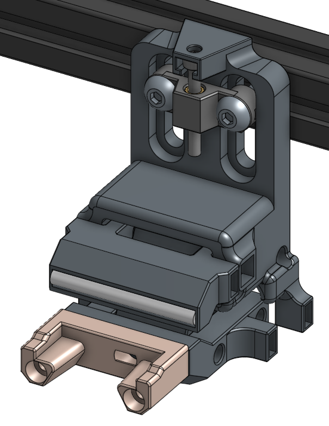
In the spirit of Unklikcy, this atrocity is put together out of things that hopefully you have laying around as spare parts.

Like the rest of Klicky-00, magnets are used as "springs" because they're magic.

## BOM


| Qty     | Item              | Note                                                                  |
| --------- | ------------------- | ----------------------------------------------------------------------- |
| 2       | M5 x 16 BHCS      | Attaching to gantry                                                   |
| 2       | M5 T-Nuts         | Attaching to gantry                                                   |
| 1       | M3 Heatset Insert | Standard Voron spec. In the height adjuster-a-thingy                  |
| 1       | M3 x 30 SHCS      | Height adjustment screw                                               |
| 2       | M3 Heatset Insert | Standard Voron spec. In the front of the klicky dock hoder            |
| 2       | 36mm PTFE Tube    | 2mm ID / 4mm OD PTFE Tube: lower hinges                               |
| 3       | 40mm PTFE Tube    | 2mm ID / 4mm OD PTFE Tube: Middle hinges + Bump slide                 |
| 2       | 30mm PTFE Tube    | 2mm ID / 4mm OD PTFE Tube: Upper hinges                               |
| 5 or 10 | 6x3mm Magnets     | Depending on how strong the magnets are: the "Springs" for the bumber |
| 2       | M3x20 SHCS        | Klicky dock to bump dock                                              |
| 1       | 6x3mm Magnet      | Behind Klicky dock                                                    |

## Instructions


| Note                                                                                                                                                                                                                                                                                                      | Picture                                                                                               |
| ----------------------------------------------------------------------------------------------------------------------------------------------------------------------------------------------------------------------------------------------------------------------------------------------------------- | ------------------------------------------------------------------------------------------------------- |
| Install heatset inserts:`` * Lower arm and height adjuster                                                                                                                                                                                                                                                | 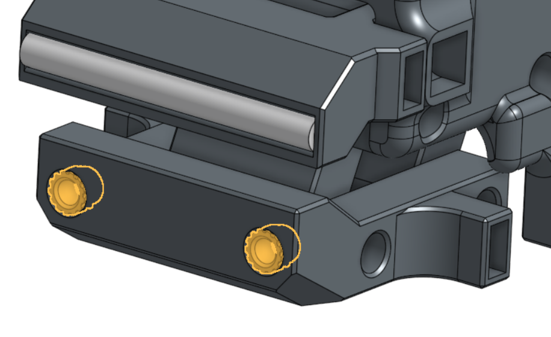   ``  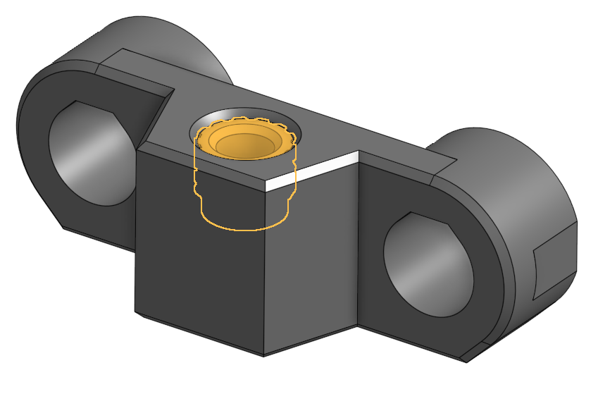 |
| Put the dock arms together with the PTFE tube in the upper and lower hinges. Don't forget the other PTFE tube on the front of the bumper!                                                                                                                                                                 | 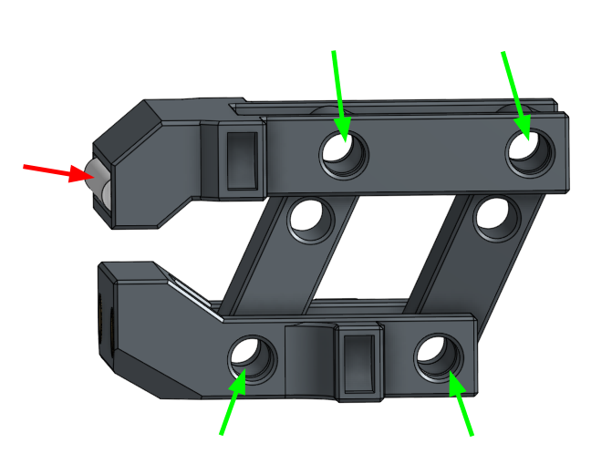                                                       |
| Slide the arms into place in the body and put the two middle hinge PTFE tubes in place                                                                                                                                                                                                                    | 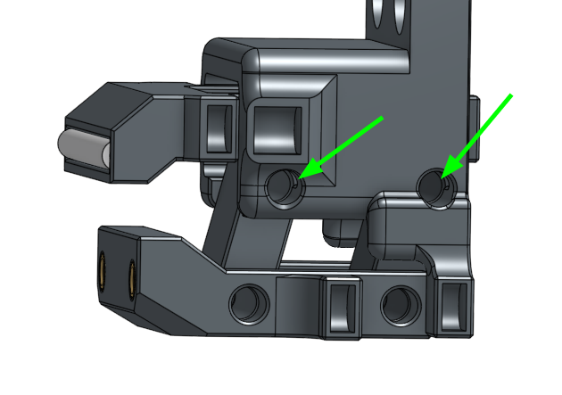                                                       |
| Thread the height adjustment screw into the height adjuster and clip it into place                                                                                                                                                                                                                        | 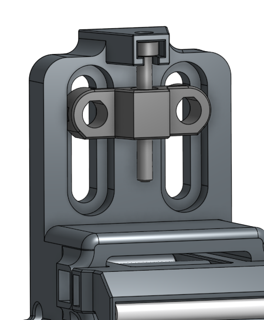                                                          |
| Attach the Klicky dock to the bump dock. Don't forget the magnet and it's polarity if you have existing probes                                                                                                                                                                                            | 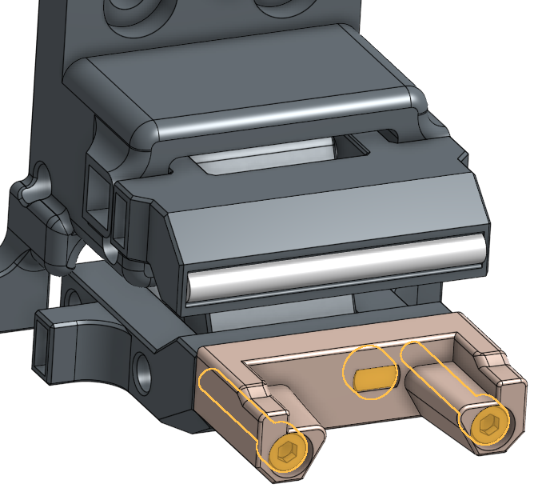                                                         |
| Install Magnets to be the "springs" and "latch"`` Depending on how strong your magnets are, and how well everything moves, you may only need these magnets on one side. The top three magnets are setup to push the upper arm forward and the lower two magnets attract to pull the lower part backwards. | 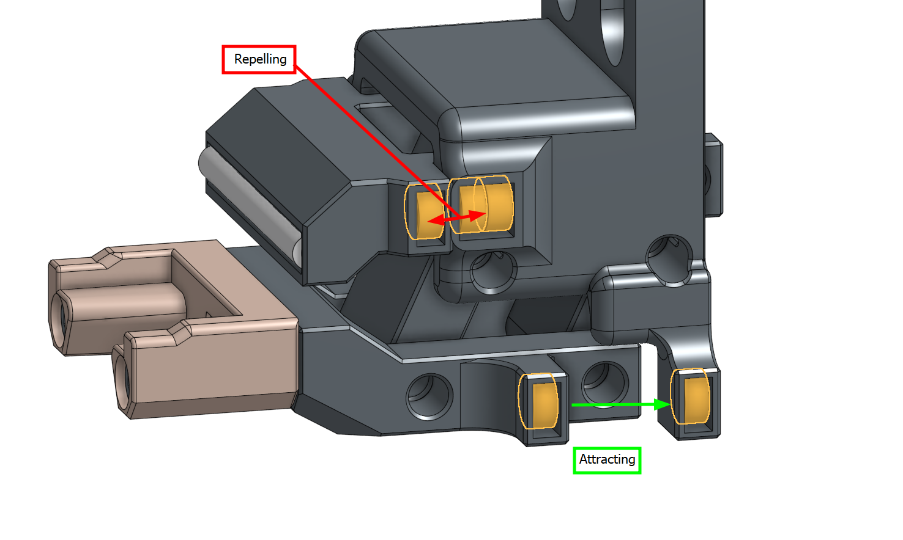                                                             |
| Time to install it into the printer.                                                                                                                                                                                                                                                                      | 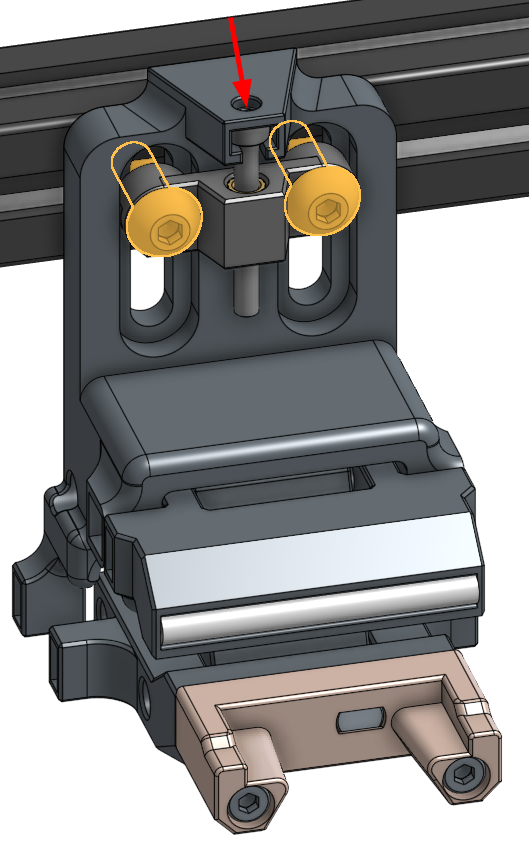                                                        |
