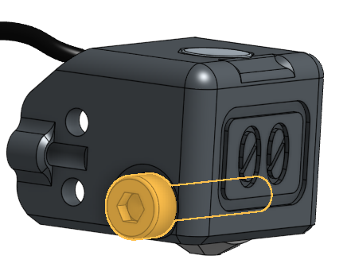
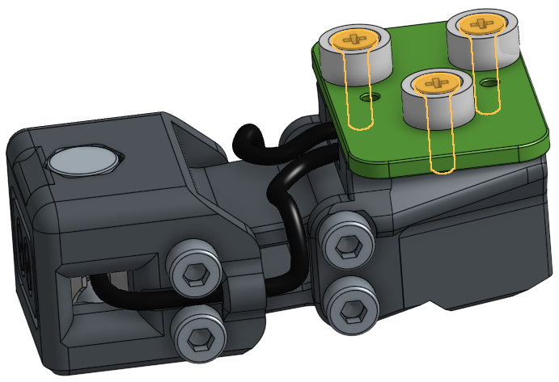

# Build Instructions
> [!WARNING]  
> This is all still in early Alpha development. Things will change. You need to have a good understanding of Klicky (+macro settings), probes, offsets and Klipper.

> [!IMPORTANT]  
> Klicky-00 is a Loooong probe. It doesn't fit behind the print bed of a standard Voron 2.4 or Trident build without a dock that retracts the probe. See "Bump dock" instructions below.

> [!WARNING]  
> You need at least 5mm travel on Y past the back of your build plate for this to work.

## Klicky-00 Probe
The probe is built from components of other projects. The original part of this project is putting the probe under the nozzle in a repeatable/automatable way.

### BOM
| Qty | Item                 | Note                                                                                                    |
| --- | -------------------- | ------------------------------------------------------------------------------------------------------- |
| 1   | PCB Klicky Lower kit | Lower PCB with switch removed, magnets, screws and heatset inserts that came with the kit or equivalent |
| 5   | 6x3mm Disc Magnets   | Probably a mix of N52 and N35 strength for adjustability                                                |
| 4   | M2.5 x 20mm SHCS     | Swing arm hinges                                                                                        |
| 2   | Lengths of wire      | Less than 2mm sheathing diameter                                                                        |

### Instructions
| Note                                                                                                                                                                                                                                                                                                                      | Picture                                         |
| ------------------------------------------------------------------------------------------------------------------------------------------------------------------------------------------------------------------------------------------------------------------------------------------------------------------------- | ----------------------------------------------- |
| Remove the built in support                                                                                                                                                                                                                                                                                               |     |
| Install the M2 heatset inserts                                                                                                                                                                                                                                                                                            |   |
| Drill out the swing arm holes with M2.5 drill bit                                                                                                                                                                                                                                                                         |         |
| Prepare the probe stylus. Sand it down so it moves smoothly inside the probe front body                                                                                                                                                                                                                                   |     |
| Install the stylus as per UnKlickyBFP. Wire wraps around top of stylus, Magnets are opposing                                                                                                                                                                                                                              |     |
| Put the screw in most of the way. Leave room for the sendond wire to wrap around                                                                                                                                                                                                                                          |           |
| Put the left side wire in place, wrapped around the screw and tighten the screw                                                                                                                                                                                                                                           |          |
| Install the front two swing arm screw hinges                                                                                                                                                                                                                                                                              |       |
| Install a magnet in the back of the lower swing arm                                                                                                                                                                                                                                                                       |   |
| Install the other two swing arm screws                                                                                                                                                                                                                                                                                    |       |
| Solder the probe wires to the bottom of the PCB Klicky lower PCB. One in the front, one at the back. Middle hole stays empty                                                                                                                                                                                              |       |
| Install the magnets that live under the PCB. The rear one should attract to the dock, the other should repel the lower swing arm. You may need to swap between N35 and N52 magnets to get just enough spring force to activate the swing arm. Too much won't let the arm move and will push the klicky PCB magnets apart. |  |
| Install the Klicky PCB magnets with the counter sunk screws. Get your polarity right. |       |

## Bump dock

In the spirit of Unklikcy, this atrocity is put together out of things that hopefully you have laying around as spare parts.

Like the rest of Klicky-00, magnets are used as "springs" because they're magic.

### BOM
| Qty     | Item              | Note                                                                  |
| ------- | ----------------- | --------------------------------------------------------------------- |
| 2       | M5 x 16 BHCS      | Attaching to gantry                                                   |
| 2       | M5 T-Nuts         | Attaching to gantry                                                   |
| 1       | M3 Heatset Insert | Standard Voron spec. In the height adjuster-a-thingy                  |
| 1       | M3 x 30 SHCS      | Height adjustment screw                                               |
| 2       | M3 Heatset Insert | Standard Voron spec. In the front of the klicky dock hoder            |
| 2       | 36mm PTFE Tube    | 2mm ID / 4mm OD PTFE Tube: lower hinges                               |
| 4       | 40mm PTFE Tube    | 2mm ID / 4mm OD PTFE Tube: Middle hinges + Bump slide                 |
| 2       | 30mm PTFE Tube    | 2mm ID / 4mm OD PTFE Tube: Upper hinges                               |
| 5 or 10 | 6x3mm Magnets     | Depending on how strong the magnets are: the "Springs" for the bumber |
| 2       | M3x20 SHCS        | Klicky dock to bump dock                                              |
| 1       | 6x3mm Magnet      | Behind Klicky dock                                                    |

### Instructions
| Note                                                                                                                                                                                                                                                                                                               | Picture                                                                                                  |
| ------------------------------------------------------------------------------------------------------------------------------------------------------------------------------------------------------------------------------------------------------------------------------------------------------------------ | -------------------------------------------------------------------------------------------------------- |
| Install heatset inserts:   * Lower arm and height adjuster                                                                                                                                                                                                                                                     |        |
| Put the dock arms together with the PTFE tube in the upper and lower hinges. Don't forget the other PTFE tube on the front of the bumper!                                                                                                                                                                          |                                                           |
| Slide the arms into place in the body and put the two middle hinge PTFE tubes in place                                                                                                                                                                                                                             |                                                           |
| Thread the height adjustment screw into the height adjuster and clip it into place                                                                                                                                                                                                                                 |                                                              |
| Attach the Klicky dock to the bump dock. Don't forget the magnet and it's polarity if you have existing probes                                                                                                                                                                                                     |                                                             |
| Install Magnets to be the "springs" and "latch"    Depending on how strong your magnets are, and how well everything moves, you may only need these magnets on one side. The top three magnets are setup to push the upper arm forward and the lower two magnets attract to pull the lower part backwards. |                                                                 |
| Time to install it into the printer.                                                                                                                                                                                                                                                                               |                                                            |